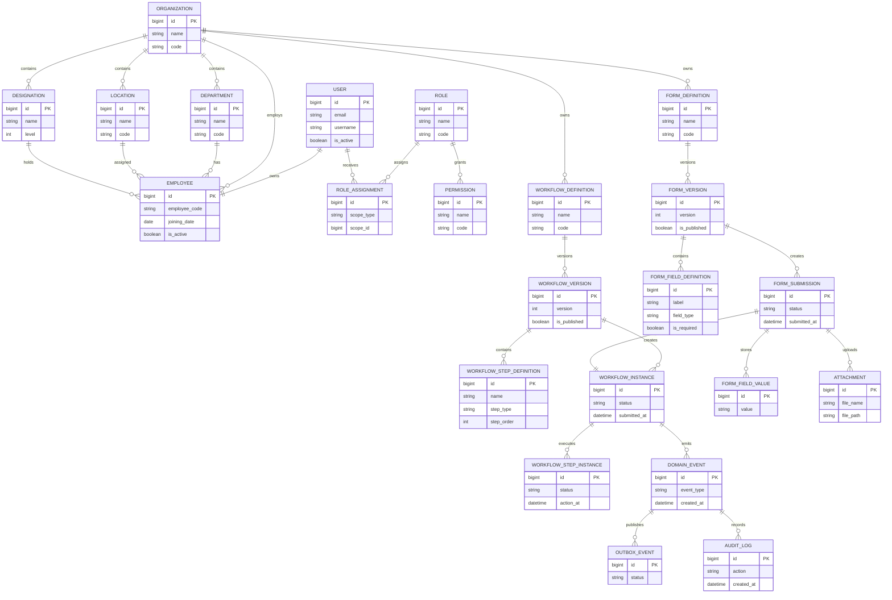

# ForgeFlow Database ER Diagram

```mermaid
erDiagram

    USER {
        bigint id PK
        string email
        string username
        boolean is_active
    }

    EMPLOYEE {
        bigint id PK
        string employee_code
        date joining_date
        boolean is_active
    }

    ORGANIZATION {
        bigint id PK
        string name
        string code
    }

    DEPARTMENT {
        bigint id PK
        string name
        string code
    }

    LOCATION {
        bigint id PK
        string name
        string code
    }

    DESIGNATION {
        bigint id PK
        string name
        int level
    }

    ROLE {
        bigint id PK
        string name
        string code
    }

    ROLE_ASSIGNMENT {
        bigint id PK
        string scope_type
        bigint scope_id
    }

    PERMISSION {
        bigint id PK
        string name
        string code
    }

    WORKFLOW_DEFINITION {
        bigint id PK
        string name
        string code
    }

    WORKFLOW_VERSION {
        bigint id PK
        int version
        boolean is_published
    }

    WORKFLOW_STEP_DEFINITION {
        bigint id PK
        string name
        string step_type
        int step_order
    }

    WORKFLOW_INSTANCE {
        bigint id PK
        string status
        datetime submitted_at
    }

    WORKFLOW_STEP_INSTANCE {
        bigint id PK
        string status
        datetime action_at
    }

    FORM_DEFINITION {
        bigint id PK
        string name
        string code
    }

    FORM_VERSION {
        bigint id PK
        int version
        boolean is_published
    }

    FORM_FIELD_DEFINITION {
        bigint id PK
        string label
        string field_type
        boolean is_required
    }

    FORM_SUBMISSION {
        bigint id PK
        string status
        datetime submitted_at
    }

    FORM_FIELD_VALUE {
        bigint id PK
        string value
    }

    ATTACHMENT {
        bigint id PK
        string file_name
        string file_path
    }

    AUDIT_LOG {
        bigint id PK
        string action
        datetime created_at
    }

    DOMAIN_EVENT {
        bigint id PK
        string event_type
        datetime created_at
    }

    OUTBOX_EVENT {
        bigint id PK
        string status
    }

    USER ||--|| EMPLOYEE : owns

    ORGANIZATION ||--o{ DEPARTMENT : contains
    ORGANIZATION ||--o{ LOCATION : contains
    ORGANIZATION ||--o{ DESIGNATION : contains
    ORGANIZATION ||--o{ EMPLOYEE : employs
    ORGANIZATION ||--o{ WORKFLOW_DEFINITION : owns
    ORGANIZATION ||--o{ FORM_DEFINITION : owns

    DEPARTMENT ||--o{ EMPLOYEE : has
    LOCATION ||--o{ EMPLOYEE : assigned
    DESIGNATION ||--o{ EMPLOYEE : holds

    ROLE ||--o{ ROLE_ASSIGNMENT : assigns
    USER ||--o{ ROLE_ASSIGNMENT : receives
    ROLE ||--o{ PERMISSION : grants

    WORKFLOW_DEFINITION ||--o{ WORKFLOW_VERSION : versions
    WORKFLOW_VERSION ||--o{ WORKFLOW_STEP_DEFINITION : contains

    WORKFLOW_VERSION ||--o{ WORKFLOW_INSTANCE : creates
    WORKFLOW_INSTANCE ||--o{ WORKFLOW_STEP_INSTANCE : executes

    FORM_DEFINITION ||--o{ FORM_VERSION : versions
    FORM_VERSION ||--o{ FORM_FIELD_DEFINITION : contains

    FORM_VERSION ||--o{ FORM_SUBMISSION : creates
    FORM_SUBMISSION ||--o{ FORM_FIELD_VALUE : stores

    FORM_SUBMISSION ||--|| WORKFLOW_INSTANCE : starts

    FORM_SUBMISSION ||--o{ ATTACHMENT : uploads

    WORKFLOW_INSTANCE ||--o{ DOMAIN_EVENT : emits
    DOMAIN_EVENT ||--o{ OUTBOX_EVENT : publishes
    DOMAIN_EVENT ||--o{ AUDIT_LOG : records
```
