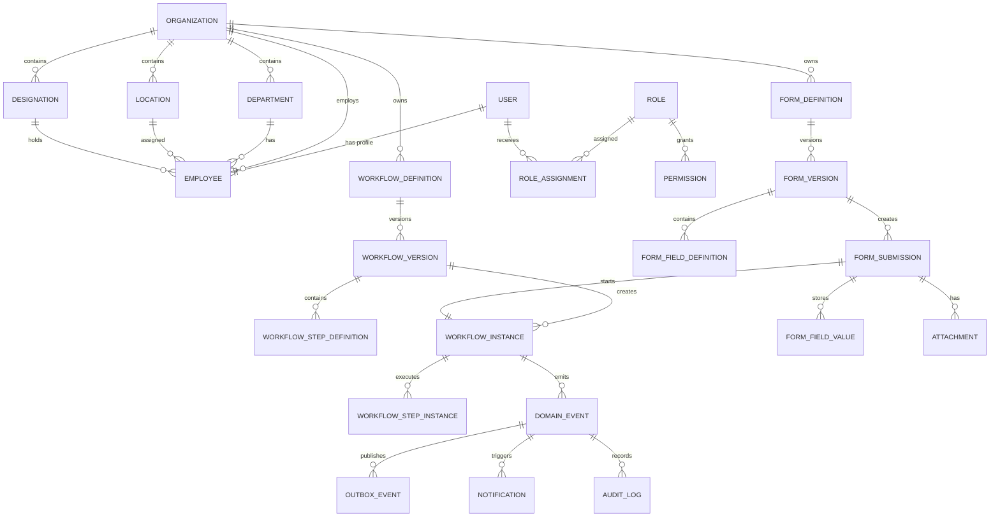

# ForgeFlow ER Diagram

```mermaid
erDiagram

    %% ==========================
    %% IDENTITY
    %% ==========================

    USER ||--|| EMPLOYEE : "has profile"

    %% ==========================
    %% ORGANIZATION
    %% ==========================

    ORGANIZATION ||--o{ DEPARTMENT : contains
    ORGANIZATION ||--o{ LOCATION : contains
    ORGANIZATION ||--o{ DESIGNATION : contains
    ORGANIZATION ||--o{ EMPLOYEE : employs
    ORGANIZATION ||--o{ WORKFLOW_DEFINITION : owns
    ORGANIZATION ||--o{ FORM_DEFINITION : owns

    DEPARTMENT ||--o{ EMPLOYEE : has
    LOCATION ||--o{ EMPLOYEE : assigned
    DESIGNATION ||--o{ EMPLOYEE : holds

    %% ==========================
    %% RBAC
    %% ==========================

    ROLE ||--o{ ROLE_ASSIGNMENT : assigned
    USER ||--o{ ROLE_ASSIGNMENT : receives
    ROLE ||--o{ PERMISSION : grants

    %% ==========================
    %% WORKFLOW
    %% ==========================

    WORKFLOW_DEFINITION ||--o{ WORKFLOW_VERSION : versions
    WORKFLOW_VERSION ||--o{ WORKFLOW_STEP_DEFINITION : contains

    WORKFLOW_VERSION ||--o{ WORKFLOW_INSTANCE : creates
    WORKFLOW_INSTANCE ||--o{ WORKFLOW_STEP_INSTANCE : executes

    %% ==========================
    %% FORMS
    %% ==========================

    FORM_DEFINITION ||--o{ FORM_VERSION : versions
    FORM_VERSION ||--o{ FORM_FIELD_DEFINITION : contains

    FORM_VERSION ||--o{ FORM_SUBMISSION : creates
    FORM_SUBMISSION ||--o{ FORM_FIELD_VALUE : stores

    %% ==========================
    %% LINK
    %% ==========================

    FORM_SUBMISSION ||--|| WORKFLOW_INSTANCE : starts

    %% ==========================
    %% EVENTS
    %% ==========================

    WORKFLOW_INSTANCE ||--o{ DOMAIN_EVENT : emits
    DOMAIN_EVENT ||--o{ OUTBOX_EVENT : publishes

    DOMAIN_EVENT ||--o{ NOTIFICATION : triggers
    DOMAIN_EVENT ||--o{ AUDIT_LOG : records

    %% ==========================
    %% FILES
    %% ==========================

    FORM_SUBMISSION ||--o{ ATTACHMENT : has
```
