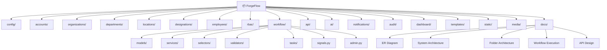

# ForgeFlow Folder Architecture

```mermaid
flowchart TD

    ROOT["📦 ForgeFlow"]

    ROOT --> CONFIG["config/"]

    ROOT --> ACCOUNTS["accounts/"]
    ROOT --> ORGANIZATIONS["organizations/"]
    ROOT --> DEPARTMENTS["departments/"]
    ROOT --> LOCATIONS["locations/"]
    ROOT --> DESIGNATIONS["designations/"]
    ROOT --> EMPLOYEES["employees/"]
    ROOT --> RBAC["rbac/"]

    ROOT --> WORKFLOW["workflow/"]

    WORKFLOW --> MODELS["models/"]
    WORKFLOW --> SERVICES["services/"]
    WORKFLOW --> SELECTORS["selectors/"]
    WORKFLOW --> VALIDATORS["validators/"]
    WORKFLOW --> TASKS["tasks/"]
    WORKFLOW --> SIGNALS["signals.py"]
    WORKFLOW --> ADMIN["admin.py"]

    ROOT --> API["api/"]
    ROOT --> AI["ai/"]
    ROOT --> NOTIFICATIONS["notifications/"]
    ROOT --> AUDIT["audit/"]
    ROOT --> DASHBOARD["dashboard/"]

    ROOT --> TEMPLATES["templates/"]
    ROOT --> STATIC["static/"]
    ROOT --> MEDIA["media/"]

    ROOT --> DOCS["docs/"]

    DOCS --> ER["ER Diagram"]
    DOCS --> SYS["System Architecture"]
    DOCS --> FOLDER["Folder Architecture"]
    DOCS --> WORKFLOWDOC["Workflow Execution"]
    DOCS --> API_DOC["API Design"]
```
