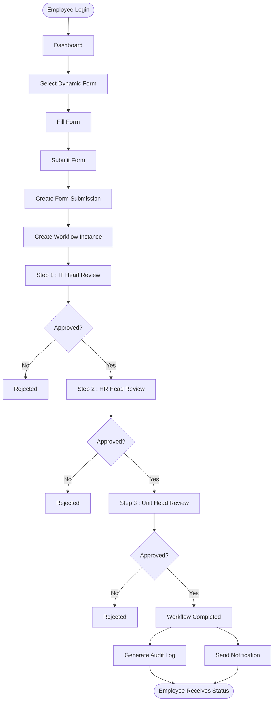

# ForgeFlow Workflow Execution

```mermaid
flowchart TD

    A([Employee Login])

    B[Dashboard]

    C[Select Dynamic Form]

    D[Fill Form]

    E[Submit Form]

    F[Create Form Submission]

    G[Create Workflow Instance]

    H[Step 1 : IT Head Review]

    I{Approved?}

    J[Rejected]

    K[Step 2 : HR Head Review]

    L{Approved?}

    M[Rejected]

    N[Step 3 : Unit Head Review]

    O{Approved?}

    P[Rejected]

    Q[Workflow Completed]

    R[Generate Audit Log]

    S[Send Notification]

    T([Employee Receives Status])


    A --> B

    B --> C

    C --> D

    D --> E

    E --> F

    F --> G

    G --> H

    H --> I

    I -- No --> J

    I -- Yes --> K

    K --> L

    L -- No --> M

    L -- Yes --> N

    N --> O

    O -- No --> P

    O -- Yes --> Q

    Q --> R

    Q --> S

    R --> T

    S --> T
```
