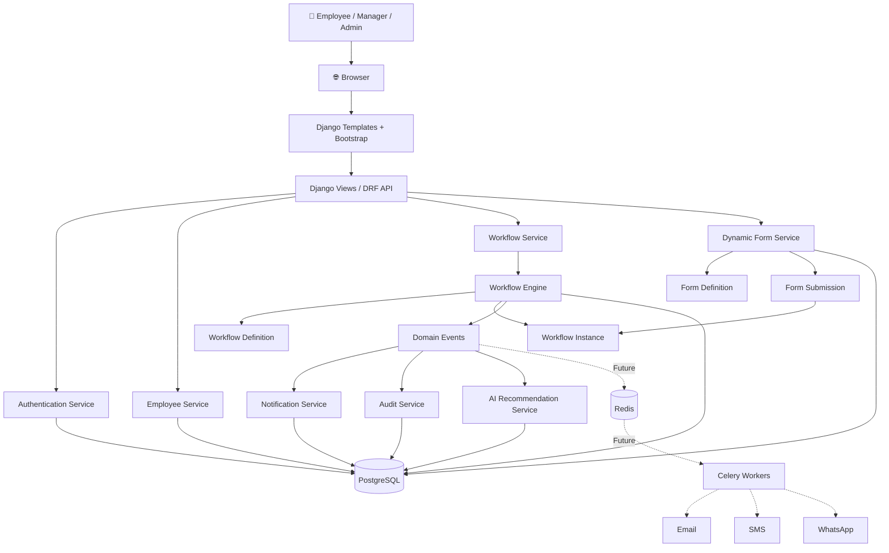

# ForgeFlow System Architecture

```mermaid
flowchart TB

    %% =====================
    %% CLIENTS
    %% =====================

    User["👤 Employee / Manager / Admin"]

    Browser["🌐 Browser"]

    User --> Browser

    %% =====================
    %% FRONTEND
    %% =====================

    Browser --> UI["Django Templates + Bootstrap"]

    %% =====================
    %% API
    %% =====================

    UI --> Views["Django Views / DRF API"]

    %% =====================
    %% SERVICES
    %% =====================

    Views --> AuthService["Authentication Service"]
    Views --> EmployeeService["Employee Service"]
    Views --> WorkflowService["Workflow Service"]
    Views --> FormService["Dynamic Form Service"]

    %% =====================
    %% WORKFLOW ENGINE
    %% =====================

    WorkflowService --> WorkflowEngine["Workflow Engine"]

    WorkflowEngine --> WorkflowDefinition["Workflow Definition"]
    WorkflowEngine --> WorkflowInstance["Workflow Instance"]

    FormService --> FormDefinition["Form Definition"]
    FormService --> FormSubmission["Form Submission"]

    FormSubmission --> WorkflowInstance

    %% =====================
    %% EVENTS
    %% =====================

    WorkflowEngine --> DomainEvents["Domain Events"]

    DomainEvents --> NotificationService["Notification Service"]
    DomainEvents --> AuditService["Audit Service"]
    DomainEvents --> AIService["AI Recommendation Service"]

    %% =====================
    %% STORAGE
    %% =====================

    NotificationService --> PostgreSQL[(PostgreSQL)]
    AuditService --> PostgreSQL
    WorkflowEngine --> PostgreSQL
    EmployeeService --> PostgreSQL
    AuthService --> PostgreSQL
    FormService --> PostgreSQL
    AIService --> PostgreSQL

    %% =====================
    %% FUTURE
    %% =====================

    DomainEvents -. Future .-> Redis[(Redis)]

    Redis -. Future .-> Celery["Celery Workers"]

    Celery -.-> Email["Email"]

    Celery -.-> SMS["SMS"]

    Celery -.-> WhatsApp["WhatsApp"]

```
